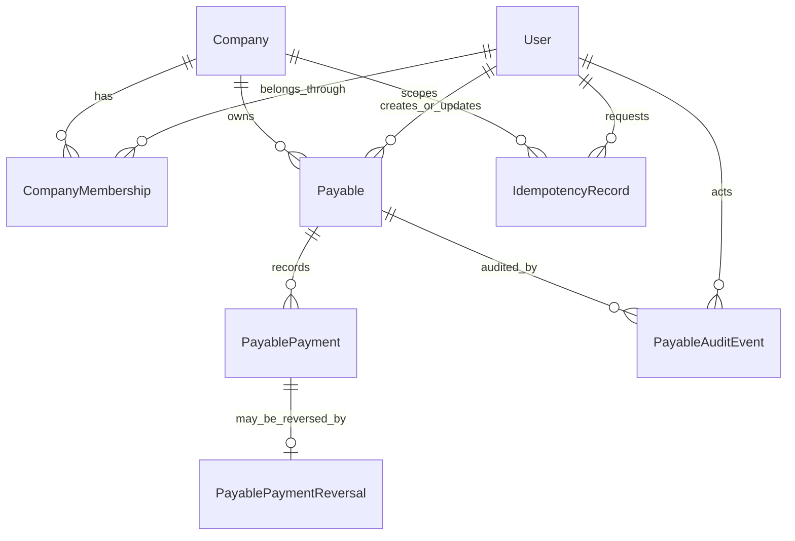
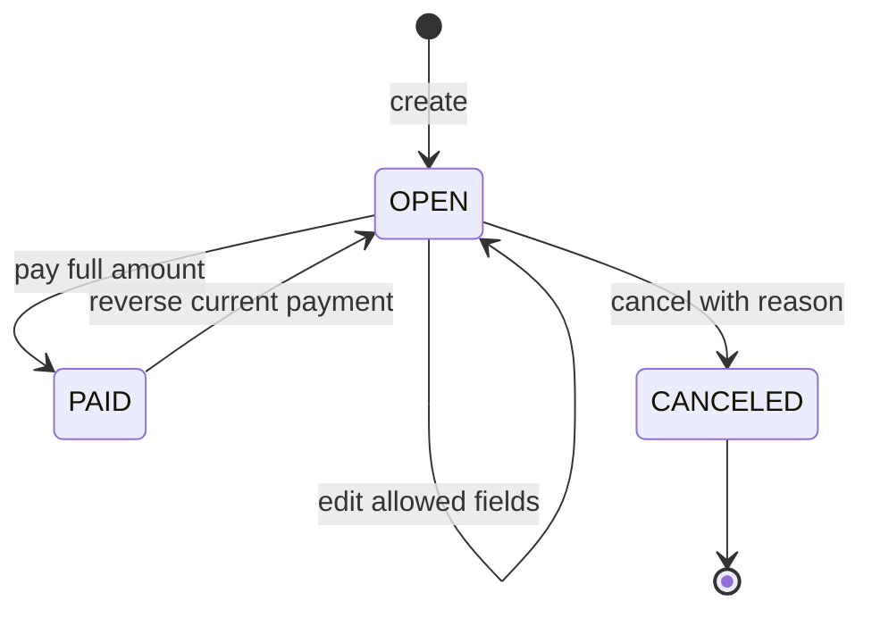

# Modelo conceitual do domínio financeiro

## 1. Propósito e status

Este documento define o modelo aprovado para a **Fase 1A — domínio mínimo de contas a pagar**. A persistência e a API mínima descritas aqui foram implementadas na Fase 1A.2; interface financeira continua pendente.

Decisões relacionadas:

- [ADR-001 — Núcleo inicial do domínio financeiro](decisions/ADR-001-financial-domain-core.md)
- [ADR-002 — Pagamento e estorno](decisions/ADR-002-payment-and-reversal-model.md)
- [ADR-003 — Estratégia de contraparte](decisions/ADR-003-counterparty-strategy.md)
- [ADR-004 — Auditoria e idempotência](decisions/ADR-004-audit-and-idempotency.md)
- [ADR-005 — Identidade, empresa e autorização](decisions/ADR-005-identity-tenant-and-authorization.md)
- [ADR-006 — Estratégia de eventos internos](decisions/ADR-006-domain-events-strategy.md)

## 2. Limite da Fase 1A

Incluído:

- criar e editar conta a pagar aberta pelos endpoints mínimos da Fase 1A.2;
- pagar integralmente;
- estornar o pagamento sem apagar o original;
- cancelar conta aberta;
- autorização, isolamento multiempresa, auditoria e idempotência aplicáveis;

Adiado:

- contas a receber;
- calendário e projeção;
- conta financeira e saldo;
- pagamento parcial, parcelas e recorrência;
- contraparte cadastrada;
- conciliação, contratos, cobrança e notificações;
- jobs, eventos, outbox e IA.

## 3. Agregados e componentes

### Agregado `Payable`

`Payable` é a raiz e controla:

- identidade e empresa proprietária;
- favorecido textual;
- descrição e documento de referência opcional;
- dinheiro original;
- competência e vencimento;
- estado e versão;
- cancelamento;
- quais ações de pagamento e estorno são válidas.

`PayablePayment` e `PayablePaymentReversal` pertencem ao histórico de liquidação do título. São registros imutáveis; sua criação passa pelo caso de uso do agregado.

### Componentes fora do agregado

- `PayableAuditEvent`: trilha append-only, gravada na mesma transação;
- `IdempotencyRecord`: coordenação de retries de comandos selecionados;
- `AuthenticatedPrincipal`: identidade já verificada;
- `TenantContext`: usuário, empresa, membership e papel já autorizados.

Auditoria e idempotência não são fonte oficial do estado financeiro.

## 4. Relacionamentos conceituais



Não existe relação com `Counterparty`, `FinancialEntry`, conta bancária, contrato ou evento de domínio nesta fase.

## 5. Entidades persistidas na Fase 1A.2

### `Payable`

| Campo                    | Semântica                                            |
| ------------------------ | ---------------------------------------------------- |
| `id`                     | UUID do título                                       |
| `companyId`              | tenant proprietário, obrigatório                     |
| `payeeName`              | snapshot textual obrigatório do favorecido           |
| `description`            | descrição curta obrigatória                          |
| `documentNumber`         | referência externa opcional, não é chave idempotente |
| `amount`                 | valor positivo `DECIMAL(19,2)`                       |
| `currencyCode`           | moeda copiada da empresa                             |
| `competenceDate`         | data civil de competência                            |
| `dueDate`                | data civil de vencimento                             |
| `status`                 | `OPEN`, `PAID` ou `CANCELED`                         |
| `version`                | concorrência otimista                                |
| `createdByUserId`        | ator da criação                                      |
| `updatedByUserId`        | último ator de atualização                           |
| `canceledAt`             | instante de cancelamento, quando aplicável           |
| `canceledByUserId`       | ator do cancelamento                                 |
| `cancellationReason`     | motivo obrigatório no cancelamento                   |
| `createdAt`, `updatedAt` | instantes técnicos em UTC                            |

### `PayablePayment`

| Campo                    | Semântica                        |
| ------------------------ | -------------------------------- |
| `id`                     | UUID do pagamento                |
| `companyId`, `payableId` | vínculo tenant-safe com o título |
| `amount`, `currencyCode` | snapshot exato do título         |
| `paidOn`                 | data civil efetiva do pagamento  |
| `recordedAt`             | instante de registro em UTC      |
| `recordedByUserId`       | ator                             |

Não possui edição ou exclusão. Uma nova liquidação após estorno cria outro registro.

### `PayablePaymentReversal`

| Campo                    | Semântica                           |
| ------------------------ | ----------------------------------- |
| `id`                     | UUID do estorno                     |
| `companyId`, `paymentId` | vínculo tenant-safe com o pagamento |
| `reason`                 | motivo obrigatório e limitado       |
| `reversedAt`             | instante do estorno em UTC          |
| `reversedByUserId`       | ator                                |

`paymentId` é único na Fase 1A.

### `PayableAuditEvent`

Contém empresa, título, ator, ação enumerada, instante, request ID, versões e diff permitido. É append-only.

### `IdempotencyRecord`

Contém escopo da chave, hash canônico, resultado mínimo e expiração de sete dias conforme ADR-004. É infraestrutura transacional, não fato financeiro. Não existe job de limpeza; uma chave expirada é substituída transacionalmente quando reutilizada.

## 5.1 Constraints e isolamento persistidos

- `DECIMAL(19,2)`, valor positivo e moeda com três letras maiúsculas;
- coerência entre `CANCELED` e seus metadados;
- FKs compostas por `companyId` para pagamento, estorno, auditoria e atores;
- um estorno por pagamento;
- chave idempotente única por empresa, ator, operação e chave;
- `RESTRICT` sobre histórico financeiro;
- índices tenant-first para estado, vencimento e relações.

`PayablePayment` não possui status mutável. Pagamento ativo é aquele sem `PayablePaymentReversal`, preservando a imutabilidade aprovada no ADR-002.

## 6. Objeto de valor `Money`

```text
Money
  amount: canonical decimal string
  currencyCode: uppercase ISO-like code
```

Invariantes:

1. não aceita `number` como fonte oficial;
2. `amount` é positivo para o título;
3. escala inválida é rejeitada, não arredondada;
4. comparação e cópia exigem a mesma moeda;
5. serialização de API sempre usa string com duas casas na Fase 1A;
6. o repositório converte explicitamente entre `Money` e Prisma Decimal.

A política inicial suporta BRL e outras moedas de duas casas somente após habilitação explícita. Moeda com expoente diferente exige ADR/migration revisada.

## 7. Modelo temporal

- `competenceDate`, `dueDate` e `paidOn` são datas civis PostgreSQL `DATE`, transmitidas como `YYYY-MM-DD`;
- criação, atualização, registro, cancelamento, estorno e auditoria são `TIMESTAMPTZ` em UTC;
- `Company.timezone` define “hoje” para validação e apresentação;
- pagamento antecipado é permitido;
- pagamento em data futura é rejeitado;
- não existe `accountingDate` ou horário de corte nesta fase;
- não se impõe `dueDate >= competenceDate` sem regra contábil aprovada.

## 8. Estados e transições



Condições derivadas:

- `OVERDUE`: `status == OPEN` e `dueDate` anterior à data local da empresa;
- `ACTIVE`: condição visual equivalente a não cancelado, não persistida;
- `ARCHIVED`: preferência futura de interface;
- `PARTIALLY_PAID`: inexistente enquanto pagamento parcial não existir.

Transições inválidas retornam conflito de estado. Não há exclusão física, reabertura de cancelado ou edição de título pago.

## 9. Invariantes transacionais

1. criar título, registrar auditoria e concluir idempotência é uma transação;
2. pagar, mudar `OPEN` para `PAID`, registrar pagamento, auditoria e idempotência é uma transação;
3. estornar, mudar `PAID` para `OPEN`, registrar estorno, auditoria e idempotência é uma transação;
4. cancelar e registrar auditoria é uma transação;
5. pagamento e estorno bloqueiam ou atualizam condicionalmente a linha do título;
6. o pagamento sempre replica valor e moeda do título;
7. filhos financeiros não podem referenciar recurso de outra empresa;
8. título pago ou cancelado não é alterado destrutivamente;
9. falha parcial provoca rollback integral.

## 10. Isolamento e autorização

O `companyId` aparece na rota, mas o backend só cria `TenantContext` após:

1. validar criptograficamente a identidade;
2. resolver o usuário interno;
3. consultar `CompanyMembership` para a empresa solicitada;
4. aplicar o papel à operação.

Matriz inicial:

| Operação                   | OWNER | ADMIN | MEMBER |
| -------------------------- | ----: | ----: | -----: |
| listar e consultar futuros |   sim |   sim |    sim |
| criar e editar             |   sim |   sim |    não |
| pagar, estornar e cancelar |   sim |   sim |    não |

Repositórios recebem `companyId` obrigatório. Relações entre tabelas financeiras usam chaves compostas incluindo empresa. IDOR e ausência de filtro de tenant são casos de teste obrigatórios.

## 11. Evolução prevista

### Contas a receber

Criar agregado `Receivable` separado. Reutilizar apenas `Money`, datas e contratos que se mostrarem semanticamente iguais. Não migrar `Payable` para tabela genérica como pré-condição.

### Calendário

Criar um modelo de leitura que normalize, no mínimo, direção, data, valor, moeda, estado, empresa e referência ao agregado de origem. Esse modelo não autoriza alterações financeiras.

### Projeção

Consumir fontes oficiais e regras determinísticas. O primeiro modelo poderá compor títulos abertos por vencimento e liquidações realizadas, sempre separando previsto e realizado.

### Conciliação

Associar transação bancária importada ao pagamento, preservando ambas as fontes. Não converter `PayablePayment` em linha de extrato.

### Contratos

Adicionar origem/versionamento de contrato de modo aditivo. Títulos materializados mantêm snapshots e não são reescritos quando o contrato muda.

## 12. Limites arquiteturais

- sem `FinancialEntry` na escrita;
- sem ledger ou partidas dobradas;
- sem Event Sourcing;
- sem outbox até existir consumidor assíncrono;
- sem pacote compartilhado de domínio com um único consumidor;
- sem contraparte obrigatória;
- sem simulação misturada a registros reais;
- sem IA como cálculo ou fonte de verdade.

## 13. Evidências da Fase 1A.2

Validação final executada em 13 de julho de 2026:

- migration aplicada em banco limpo e sobre o schema da Fase 1A.1, sem perda dos registros fundacionais;
- `prisma migrate status` atualizado e `prisma migrate diff` sem drift;
- lint e typecheck aprovados;
- 82 testes da API e 3 testes do frontend aprovados;
- build da API, frontend e Prisma Client aprovado;
- auditoria de dependências sem vulnerabilidades conhecidas;
- `git diff --check` aprovado.

Os testes cobrem dinheiro e datas civis, transições, retries idempotentes, concorrência, rollback transacional, autorização por papel, isolamento multiempresa e constraints do banco. A interface financeira, consultas/listagem, RLS e funcionalidades adiadas na seção 2 permanecem fora desta fase.
